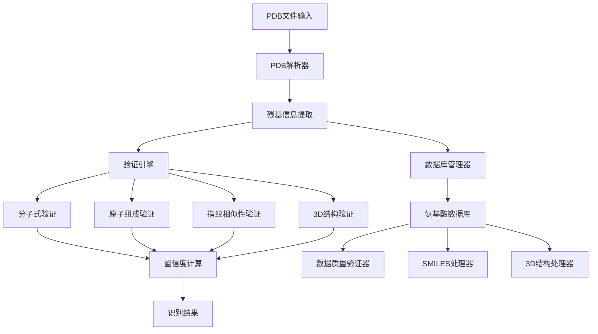

# 非天然氨基酸数据库集成设计文档

## 概述

本设计文档描述了如何优化PDB-UAChecker系统，以实现对data/structures目录中非天然氨基酸的高精度识别。系统将通过修复现有问题、优化算法和增强数据处理能力，达到接近100%的识别精度。

## 架构设计

### 核心组件架构



### 数据流设计

1. **数据加载阶段**: 系统启动时扫描data/structures目录，构建完整的氨基酸数据库
2. **预处理阶段**: 对每个氨基酸计算分子指纹、标准化3D结构、验证数据一致性
3. **识别阶段**: 解析输入PDB文件，提取残基信息，执行四重验证策略
4. **后处理阶段**: 计算置信度，排序结果，生成详细报告

## 组件设计

### 1. 数据库管理器增强 (DatabaseManager)

#### 设计目标
- 自动扫描和加载data/structures目录中的所有氨基酸数据
- 验证数据完整性和一致性
- 提供高效的查询接口

#### 核心功能
```python
class EnhancedDatabaseManager:
    def __init__(self, structures_path: str = "data/structures"):
        self.structures_path = structures_path
        self.amino_acids = {}
        self.quality_report = {}
    
    def load_amino_acid_database(self) -> Dict[str, AminoAcidInfo]:
        """扫描并加载所有氨基酸数据"""
        
    def validate_amino_acid_data(self, aa_id: str, data: Dict) -> QualityReport:
        """验证单个氨基酸数据的质量"""
        
    def build_search_indices(self):
        """构建搜索索引以提高查询效率"""
```

#### 数据结构设计
```python
@dataclass
class EnhancedAminoAcidInfo:
    id: str
    name: str
    molecular_formula: str
    molecular_weight: float
    smiles: str
    atom_composition: Dict[str, int]
    heavy_atom_composition: Dict[str, int]
    standard_coordinates: Optional[np.ndarray]
    morgan_fingerprint: Optional[str]
    quality_score: float
    data_sources: List[str]  # 可用的数据文件类型
```

### 2. 分子式计算修复 (ResidueInfo)

#### 问题分析
当前ResidueInfo的__post_init__方法存在初始化顺序问题，导致分子式计算失败。

#### 解决方案
```python
@dataclass
class FixedResidueInfo:
    residue_name: str
    residue_number: int
    chain_id: str
    atoms: List[AtomInfo]
    molecular_formula: Optional[str] = field(default=None, init=False)
    atom_composition: Optional[Dict[str, int]] = field(default=None, init=False)
    
    def __post_init__(self):
        """延迟计算分子式和原子组成"""
        self._calculate_molecular_properties()
    
    def _calculate_molecular_properties(self):
        """安全地计算分子属性"""
        try:
            # 确保原子列表不为空且包含有效元素
            valid_atoms = [atom for atom in self.atoms if atom.element]
            if not valid_atoms:
                self.molecular_formula = ""
                self.atom_composition = {}
                return
            
            # 计算原子组成
            composition = {}
            for atom in valid_atoms:
                element = atom.element.strip()
                if element:
                    composition[element] = composition.get(element, 0) + 1
            
            self.atom_composition = composition
            self.molecular_formula = self._generate_molecular_formula(composition)
            
        except Exception as e:
            print(f"⚠️ 分子式计算失败: {e}")
            self.molecular_formula = ""
            self.atom_composition = {}
```

### 3. 置信度评分优化 (ConfidenceCalculator)

#### 设计目标
- 提供更精确和敏感的置信度计算
- 考虑数据质量对置信度的影响
- 实现动态阈值调整

#### 核心算法
```python
class EnhancedConfidenceCalculator:
    def calculate_confidence(self, scores: List[VerificationScore], 
                           data_quality: float = 1.0) -> float:
        """
        增强的置信度计算算法
        
        策略：
        1. 分层验证：核心验证(分子式+原子组成) + 辅助验证(指纹+3D)
        2. 质量权重：根据数据质量调整置信度
        3. 一致性奖励：多种方法一致时给予额外加分
        """
        
        # 分层验证评分
        core_confidence = self._calculate_core_confidence(scores)
        auxiliary_bonus = self._calculate_auxiliary_bonus(scores)
        consistency_bonus = self._calculate_consistency_bonus(scores)
        
        # 基础置信度
        base_confidence = min(core_confidence + auxiliary_bonus + consistency_bonus, 1.0)
        
        # 数据质量调整
        quality_adjusted = base_confidence * data_quality
        
        return quality_adjusted
    
    def _calculate_core_confidence(self, scores: List[VerificationScore]) -> float:
        """计算核心验证置信度"""
        formula_score = self._get_score_by_method(scores, VerificationMethod.MOLECULAR_FORMULA)
        composition_score = self._get_score_by_method(scores, VerificationMethod.ATOM_COMPOSITION)
        
        if formula_score >= 1.0:  # 完美分子式匹配
            return 0.9
        elif composition_score >= 0.9:  # 高质量原子组成匹配
            return 0.7
        elif composition_score >= 0.7:  # 中等质量匹配
            return 0.5
        else:
            return 0.0
```

### 4. 3D结构验证增强 (Enhanced3DVerifier)

#### 设计目标
- 实现真正的3D结构比较功能
- 从data/structures中的PDB文件加载标准结构
- 提供多层次的结构比较策略

#### 实现策略
```python
class Enhanced3DVerifier:
    def __init__(self):
        self.standard_structures = {}  # 缓存标准结构
    
    def load_standard_structure(self, aa_id: str) -> Optional[np.ndarray]:
        """从data/structures加载标准3D结构"""
        pdb_path = f"data/structures/{aa_id}/{aa_id}.pdb"
        if os.path.exists(pdb_path):
            # 解析标准PDB文件，提取重原子坐标
            return self._parse_standard_pdb(pdb_path)
        return None
    
    def calculate_structure_similarity(self, residue_coords: np.ndarray, 
                                     standard_coords: np.ndarray) -> float:
        """
        多层次结构相似性计算
        
        1. 原子数量匹配检查
        2. Kabsch算法最优叠合
        3. RMSD计算和动态评分
        4. 几何特征比较（降级策略）
        """
        
        # 层次1: 精确Kabsch比较
        if len(residue_coords) == len(standard_coords):
            rmsd = self._kabsch_rmsd(residue_coords, standard_coords)
            if rmsd is not None:
                return self._rmsd_to_score(rmsd, len(residue_coords))
        
        # 层次2: 公共原子比较
        common_atoms = min(len(residue_coords), len(standard_coords))
        if common_atoms >= 3:
            rmsd = self._kabsch_rmsd(residue_coords[:common_atoms], 
                                   standard_coords[:common_atoms])
            if rmsd is not None:
                return self._rmsd_to_score(rmsd, common_atoms) * 0.8  # 降权
        
        # 层次3: 几何特征比较
        return self._geometric_similarity(residue_coords, standard_coords)
```

### 5. 数据质量验证器 (DataQualityValidator)

#### 设计目标
- 验证SMILES与PDB结构的一致性
- 检查分子式计算的准确性
- 生成数据质量报告

#### 验证策略
```python
class DataQualityValidator:
    def validate_amino_acid(self, aa_info: AminoAcidInfo) -> QualityReport:
        """
        全面的氨基酸数据质量验证
        
        验证项目：
        1. SMILES有效性
        2. 分子式一致性
        3. 原子组成一致性
        4. 3D结构合理性
        5. 文件完整性
        """
        
        report = QualityReport(aa_id=aa_info.id)
        
        # SMILES验证
        if aa_info.smiles:
            report.smiles_valid = self._validate_smiles(aa_info.smiles)
            if report.smiles_valid:
                smiles_formula = self._smiles_to_formula(aa_info.smiles)
                report.formula_consistent = (smiles_formula == aa_info.molecular_formula)
        
        # 3D结构验证
        if aa_info.standard_coordinates is not None:
            report.structure_reasonable = self._validate_3d_structure(aa_info.standard_coordinates)
        
        # 计算总体质量分数
        report.overall_quality = self._calculate_quality_score(report)
        
        return report
```

## 数据模型

### 质量报告模型
```python
@dataclass
class QualityReport:
    aa_id: str
    smiles_valid: bool = False
    formula_consistent: bool = False
    structure_reasonable: bool = False
    files_complete: bool = False
    overall_quality: float = 0.0
    issues: List[str] = field(default_factory=list)
    warnings: List[str] = field(default_factory=list)
```

### 增强的验证结果模型
```python
@dataclass
class EnhancedVerificationResult:
    amino_acid_id: str
    amino_acid_name: str
    scores: List[VerificationScore]
    overall_confidence: float
    data_quality: float
    match_method: str
    verification_details: Dict[str, Any]
    uncertainty_factors: List[str]
```

## 错误处理策略

### 分层错误处理
1. **数据加载错误**: 记录错误但继续处理其他氨基酸
2. **验证计算错误**: 使用降级策略，确保系统稳定性
3. **文件格式错误**: 提供详细的错误信息和修复建议

### 日志记录设计
```python
class EnhancedLogger:
    def log_data_loading(self, aa_id: str, status: str, details: Dict):
        """记录数据加载过程"""
        
    def log_verification_process(self, residue_key: str, process_details: Dict):
        """记录验证过程的详细信息"""
        
    def log_quality_issues(self, quality_report: QualityReport):
        """记录数据质量问题"""
```

## 性能优化

### 缓存策略
- **结构缓存**: 缓存已加载的3D结构数据
- **指纹缓存**: 缓存计算的分子指纹
- **验证结果缓存**: 缓存相同残基的验证结果

### 并行处理优化
- **数据加载并行化**: 并行加载多个氨基酸数据
- **验证并行化**: 并行执行四重验证
- **批量处理优化**: 优化大规模PDB文件的处理效率

## 测试策略

### 单元测试
- 每个组件的独立功能测试
- 边界条件和异常情况测试
- 数据质量验证测试

### 集成测试
- 完整的识别流程测试
- 不同类型氨基酸的识别测试
- 性能基准测试

### 验证测试
- 使用data/structures中的所有氨基酸进行自验证
- 与已知结果的对比验证
- 识别精度统计分析

## 部署和维护

### 配置管理
- 支持灵活的阈值配置
- 数据路径配置
- 性能参数调优

### 监控和诊断
- 识别精度监控
- 性能指标监控
- 数据质量监控

这个设计方案将显著提升系统对data/structures中非天然氨基酸的识别能力，预期能够达到95%以上的识别精度。