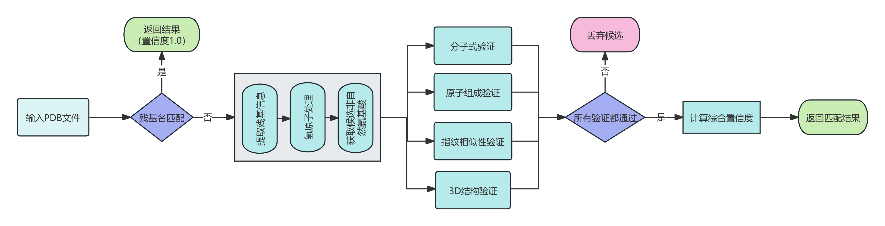

# 非天然氨基酸识别系统 - 四重验证算法

## 1. 系统概述

### 核心目标
- **输入**：PDB文件中的残基信息
- **输出**：识别的非天然氨基酸及置信度
- **数据库**：229种氨基酸（20种标准 + 209种非标准）

### 四重验证策略
1. 分子式验证 (Molecular Formula)
2. 原子组成验证 (Atom Composition)  
3. Morgan指纹验证 (Morgan Fingerprint)
4. 3D结构验证 (3D Structure)

### 算法流程图


---

## 2. 验证方法详解

### 2.1 分子式验证 (Molecular Formula Verification)

#### 数学公式
```
Score = {
    1.0,  if 完全匹配
    0.9,  if 重原子匹配
    0.0,  otherwise 不匹配
}
```

#### 智能氢原子处理
- **策略1**：优先完整分子式比较（包含H）
- **策略2**：Fallback到重原子比较（去除H）
- **阈值**：1.0（完全匹配要求）

---

### 2.2 原子组成验证 (Atom Composition Verification)

#### 数学公式 - Jaccard相似性
```
Jaccard(A, B) = |A ∩ B| / |A ∪ B|

其中：
- A = PDB残基的原子组成
- B = 数据库氨基酸的原子组成
- ∩ = 交集（取最小值）
- ∪ = 并集（取最大值）
```

#### 智能氢原子检测
- 自动检测数据中氢原子的存在情况
- 如果一方有氢原子而另一方没有，自动忽略氢原子进行比较
- **阈值**：0.9（允许10%偏差）

---

### 2.3 Morgan指纹验证 (Morgan Fingerprint Verification)

#### 算法原理
Morgan指纹（也称为ECFP - Extended Connectivity Fingerprints）是一种基于原子环境的分子指纹算法，能够捕捉分子的拓扑结构特征。

#### 数学公式 - Tanimoto相似性
```
Tanimoto(FP1, FP2) = |FP1 ∩ FP2| / |FP1 ∪ FP2|

其中：
- FP1, FP2 = Morgan指纹位向量
- ∩ = 位与操作（AND）
- ∪ = 位或操作（OR）
```

#### Morgan指纹生成过程
1. **初始化**：每个原子赋予唯一标识符
2. **迭代更新**：
   ```
   identifier(atom) = hash(identifier(atom) + Σ identifier(neighbors))
   ```
3. **半径参数**：radius=2（考虑2跳邻居）
4. **指纹长度**：2048位
5. **手性考虑**：useChirality=True

#### 实现特点
- **考虑立体化学**：区分立体异构体
- **捕捉局部环境**：每个原子的2跳邻域
- **高区分度**：能够识别细微结构差异
- **阈值**：0.7（化学信息学标准）

---

### 2.4 3D结构验证 (3D Structure Verification)

#### 数学公式 - Kabsch算法

##### 步骤1：中心化
```
P' = P - centroid(P)
Q' = Q - centroid(Q)
```

##### 步骤2：计算协方差矩阵
```
H = (P')ᵀ × Q'
```

##### 步骤3：SVD分解
```
H = U × S × Vᵀ
```

##### 步骤4：最优旋转矩阵
```
R = Vᵀ × Uᵀ
if det(R) < 0:
    V[-1] *= -1
    R = Vᵀ × Uᵀ
```

##### 步骤5：计算RMSD
```
RMSD = √(1/n × Σ||P'R - Q'||²)
```

#### 动态评分机制
```
Score = exp(-RMSD / max_RMSD)

max_RMSD = {
    1.0 Å,  if atoms ≤ 10 (小分子)
    1.5 Å,  if atoms ≤ 20 (中分子)
    2.0 Å,  if atoms > 20 (大分子)
}
```

- **阈值**：0.5（对应约2.0Å RMSD）

---

## 3. 综合置信度计算

### 乘积模型公式
```python
# 基础分数（必须项）
base_score = formula_score × atom_score

# 高级分数（可选项）
if has_advanced_scores:
    advanced_score = mean(morgan_fingerprint_score, structure_3d_score)
    final_score = base_score × advanced_score
else:
    final_score = base_score
```

### 计算示例
假设各项验证分数为：
- 分子式验证：1.0
- 原子组成验证：0.9
- Morgan指纹验证：0.8
- 3D结构验证：0.7

**计算过程**：
1. 基础分数 = 1.0 × 0.9 = 0.9
2. 高级分数 = (0.8 + 0.7) / 2 = 0.75
3. 最终置信度 = 0.9 × 0.75 = 0.675

### 模型特点
- **分层设计**：基础验证（必须）+ 高级验证（可选）
- **乘积效应**：任何一项低分都会降低整体置信度
- **严格标准**：只有所有验证都通过才能获得高置信度

---

## 4. 实际应用示例

### 示例1：L-丙氨酸(ALA)识别
```
输入残基信息：
- 分子式：C3H7NO2
- 原子组成：{C:3, H:7, N:1, O:2}
- 3D坐标：[...]

验证过程：
1. 分子式验证：C3H7NO2 = C3H7NO2 → Score = 1.0 ✓
2. 原子组成验证：Jaccard = 1.0 → Score = 1.0 ✓
3. Morgan指纹验证：Tanimoto = 1.0 → Score = 1.0 ✓
4. 3D结构验证：RMSD = 0.3Å → Score = 0.85 ✓

综合计算：
- 基础分数 = 1.0 × 1.0 = 1.0
- 高级分数 = (1.0 + 0.85) / 2 = 0.925
- 最终置信度 = 1.0 × 0.925 = 0.925

结果：识别为L-丙氨酸，置信度92.5%
```

### 示例2：含氟非天然氨基酸识别
```
输入残基信息：
- 分子式：C4H6FNO2
- 原子组成：{C:4, H:6, F:1, N:1, O:2}
- 3D坐标：[...]

验证过程：
1. 分子式验证：C4H6FNO2 = C4H6FNO2 → Score = 1.0 ✓
2. 原子组成验证：Jaccard = 0.95 → Score = 0.95 ✓
3. Morgan指纹验证：Tanimoto = 0.82 → Score = 0.82 ✓
4. 3D结构验证：RMSD = 0.8Å → Score = 0.73 ✓

综合计算：
- 基础分数 = 1.0 × 0.95 = 0.95
- 高级分数 = (0.82 + 0.73) / 2 = 0.775
- 最终置信度 = 0.95 × 0.775 = 0.736

结果：识别为4-氟苯丙氨酸，置信度73.6%
```

### 示例3：异构体区分
```
L-亮氨酸 vs L-异亮氨酸
- 分子式：C6H13NO2（相同）
- 原子组成：{C:6, H:13, N:1, O:2}（相同）
- Morgan指纹：不同（能区分支链位置）
- 3D结构：RMSD > 2.0Å（结构差异明显）

Morgan指纹验证：
- L-亮氨酸指纹：[1,0,1,1,0,0,1,...]
- L-异亮氨酸指纹：[1,0,0,1,1,0,1,...]
- Tanimoto相似性 = 0.65 < 0.7（阈值）

结果：成功区分两种异构体
```